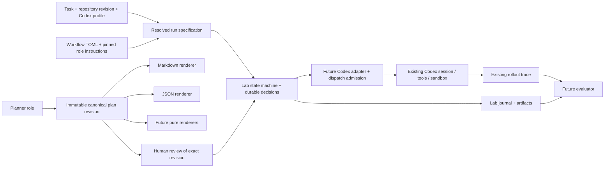

# Architecture research: Codex workflow laboratory

Research date: 2026-09-07. Source baseline: `openai/codex` commit `112be0bd74ce327788613f4f8f92e8b7c92447c7`. All paths below are relative to this checkout. Line numbers describe that commit, not a promise about later upstream versions.

This document records the pre-implementation discoveries and design decisions. The user approved the resulting plan, and the domain foundation is now implemented; see `README.md` for its APIs and limitations. A separately approved restricted runtime followed: see `LIVE_INTEGRATION_PLAN.md` for the refined integration design and `RUNNING.md` for the live host's actual interface and boundaries. Statements below that defer runtime work describe the foundation checkpoint. The reviewed specification remains in `implementation-plan.json`; `IMPLEMENTATION_PLAN.md` is its human review companion. See `PROGRESS.md` for authorization and execution status.

## Source map

| Concern | Actual files / interfaces | Consequence for the laboratory |
| --- | --- | --- |
| Entrypoints | `codex-rs/cli/src/main.rs`; `exec`; `tui` | Do not add a workflow selector to every CLI surface in the first increment. |
| Shared client lifecycle | `codex-rs/app-server-client/src/lib.rs`: `InProcessAppServerClient`, `InProcessClientStartArgs`, typed requests/events; its README | Reuse app-server bootstrap, transport, and shutdown for a later lab client. The in-process constructor has substantial dependencies; do not copy the sample's hand-built `Config`. |
| Embedding API | `codex-rs/core-api/src/lib.rs`; `core/src/thread_manager.rs`: `ThreadManager`, `StartThreadOptions` | Existing public Rust embedding seam; carries extension registry and host-seeded `thread_extension_init`. It is not a new implementation of an agent. |
| Agent loop | `codex-rs/core/src/session/turn.rs:162`: `run_turn`; `core/src/tasks/regular.rs`; `core/src/session/` | Keep planning and execution experiments out of this large, changing loop where possible. There is no `core/src/codex.rs` at this revision. |
| Extensions | `codex-rs/ext/extension-api/src/registry.rs:26`: `ExtensionRegistryBuilder`; `contributors.rs`; `state.rs` | Already provides typed context, thread/turn/tool lifecycle, token usage, skill invocation, and tool contributions. Reuse this vocabulary rather than create a parallel generic event bus. |
| Extension installation | `codex-rs/app-server/src/extensions.rs`; `app-server/src/message_processor.rs:331`; CLI debug prompt path around `cli/src/main.rs:2348` | A later extension should install at the host's composition root, not through edits in every tool or every model call. |
| Provider configuration | `codex-rs/model-provider-info/src/lib.rs:97`: `ModelProviderInfo` | Existing base URL, auth references, headers, timeouts, retries, and transport flags are sufficient for a compatible Muse endpoint. |
| Provider runtime | `codex-rs/model-provider/src/provider.rs:148`: `ModelProvider`; `:320`: `create_model_provider` | Keep provider identity separate from planner, renderer, executor, and evaluator. |
| Model calls | `codex-rs/core/src/client.rs:1562,2027`; `codex-api/src/endpoint/responses.rs`; `codex-api/src/sse/responses.rs` | Reuse the transport, streaming parser, error/retry handling, and existing traces. |
| Model metadata | `codex-rs/models-manager/src/manager.rs`: `ModelsManager`, `StaticModelsManager`; `protocol/src/openai_models.rs:400`: `ModelInfo` | A static model catalog can pin context/tool/instruction metadata independently of workflow selection. |
| Configuration | `codex-rs/config/src/config_toml.rs:155`; `core/src/config/mod.rs:609,1374`: resolved `Config`, `ConfigBuilder` | Avoid extending high-churn resolved config structs with lab-specific fields in the foundation. |
| Layers / provenance | `codex-rs/config/src/loader/README.md`; `state.rs:455`: `ConfigLayerStack::effective_config`; `fingerprint.rs:57` | Existing effective config, per-key origins, layer versions, and disabled layers supply reproducibility evidence. Raw merged TOML is not the whole resolved runtime configuration. |
| Profiles | `codex-rs/core/src/config/mod.rs:1939`; `config/src/loader/mod.rs:315` | `--profile NAME` loads `$CODEX_HOME/NAME.config.toml` over base user config. Legacy `[profiles.NAME]` is not the right extension target. |
| Skill discovery | `codex-rs/ext/skills/src/host_service.rs:83,154,173`: `HostSkillsService`, extra roots, config snapshots; `host_roots.rs`; `loader/host.rs` | Reuse discovery/loading at integration time. Resolve exact role selections and pin content separately. |
| Skill invocation | `codex-rs/skills/src/selection.rs`; `protocol/src/user_input.rs`: `UserInput::Skill`; `core/src/session/turn.rs:873,890`; `ext/skills/src/host_prompt.rs:69` | Explicit typed skill inputs activate selected skills. Availability/enablement alone does not make invocation deterministic. |
| Model context | `codex-rs/history`; `core/src/context_manager`; `core/src/session/turn.rs`; `context-fragments` | Keep canonical plan and approval state outside model history. Inject bounded views through existing fragment interfaces later. |
| Compaction | `codex-rs/core/src/compact.rs`; `compact_remote.rs`; `session/turn.rs:1089,1256` | Reuse compaction policy and implementation; log effective thresholds and actual path. Compaction cannot erase an approval or create one. |
| Tool dispatch | `codex-rs/core/src/tools/registry.rs:495`: `ToolRegistry::dispatch_any_with_terminal_outcome`; `codex-rs/tools` | Direct model calls and code-mode nested tool calls converge here. This is the candidate universal admission seam, subject to integration tests. |
| Existing checklist | `codex-rs/protocol/src/plan_tool.rs:17,24`; `core/src/tools/handlers/plan.rs:87` | `update_plan` is a TODO/checklist tool, expressly distinct from Plan mode. Its text/status items have no stable IDs or approval semantics. Do not repurpose its protocol as the lab Plan. |
| Existing approvals | `codex-rs/ext/extension-api/src/contributors.rs:357`: `ApprovalReviewContributor`; core approval/sandbox machinery | Action approvals remain upstream-owned. They do not substitute for approval of a particular plan revision. |
| Subagents | `codex-rs/ext/agent`; `core/src/agent`; `core/src/thread_manager.rs`; `agent-graph-store` | Reuse lifecycle. A root's lab authority is not automatically inherited by children; first integrated profile must disable child agents until tested inheritance exists. |
| Persistence | `codex-rs/rollout`; `thread-store`; `state`; `history` | Keep existing conversation/session persistence; store only lab-owned artifacts in the new run directory. |
| Detailed trace | `codex-rs/rollout-trace/README.md`; `src/thread.rs`; inference/tool producers in core | Existing opt-in trace already captures request/response, tool/code-mode/terminal activity, and multi-agent relationships. Do not build a competing trace pipeline. |

## Findings that change the design

### A lifecycle observer is not an admission policy

`ToolLifecycleContributor::on_tool_start` returns `Future<Output = ()>` (`ext/extension-api/src/contributors.rs:329`). It runs after pre-tool hooks and cannot reject execution. `ApprovalReviewContributor` receives actions that upstream has chosen to review; already-authorized tools can bypass that path.

Command hooks are also unsuitable as the sole gate. `hooks/src/events/pre_tool_use.rs:193` initializes `should_block = false`; runner errors, malformed JSON, unexpected exits, and serialization failure can leave execution unblocked. Hooks are not invoked for every tool: the registry depends on an optional pre-tool payload, and `write_stdin` intentionally lacks one. Post-tool hooks run after the side effect.

A client refusing to start an implementing turn is useful but insufficient. A research turn can still invoke remote MCP, extension, dynamic, code-mode, or child-agent capabilities. Read-only filesystem sandboxing does not classify all such side effects. Shell commands cannot safely be classified as read-only with a list of string prefixes.

**Decision:** the first increment will expose and test a fail-closed domain state machine and its action-admission contract. It will explicitly not advertise enforcement over live Codex tools. A later integration needs a synchronous, fail-closed admission decision at dispatch plus a host-controlled stop/drain boundary. Do not rush a superficially small hook-based gate into production.

### Reuse the existing trace

`CODEX_ROLLOUT_TRACE_ROOT` enables local bundles with `manifest.json`, sequence-numbered `trace.jsonl`, and `payloads/*.json`; `codex debug trace-reduce` produces `state.json`. Inference records include request evidence and output/usage; tool records distinguish direct calls, nested code-mode calls, and terminal operations.

This is diagnostic, best-effort recording. It is not an authoritative approval log. Local compaction's inference requests/responses are explicitly untraced in `core/src/compact.rs:778`; its lifecycle notifications remain observable. Resumed child trace handling also has limitations. Missing observations must remain missing, not become zero-valued metrics or evidence of no deviations.

**Decision:** write a small lab journal for state transitions, decisions, plan revisions, and evidence references. Reference the upstream trace for model/tool evidence. Record trace availability/completeness explicitly. Do not alter upstream trace failure behavior just to make lab recording stricter.

### Named profiles already exist

Current profile-v2 configuration uses separate profile files, overlaid with other Codex layers. The loader documents user, project, CLI/session, enterprise, system, and managed precedence. A later layer or managed requirement can affect an experiment even when the selected profile is unchanged.

**Decision:** lab workflow definitions get their own strict, small TOML schema. Ordinary Codex profiles remain responsible for model/provider/permissions/context configuration. The run manifest binds both resolved configurations; workflow inheritance applies only to lab-owned fields. No initial change to `ConfigToml`, `ConfigProfile`, or existing CLI flags.

### Skills can be selected explicitly, but loading can fail open

Use exact local `SKILL.md` paths and typed `UserInput::Skill` inputs during integration. That variant carries a filesystem path; extension-owned `skill://` resources instead use `UserInput::Mention` and are deferred. `[[skills.config]]` controls availability, and `allow_implicit_invocation` affects implicit selection; neither mandates loading. Existing loaders can warn and continue or truncate oversized instructions.

**Decision:** the foundation resolves role instruction references, checks size and content hashes, and freezes their bytes. The later adapter must confirm that those exact instructions reached model context, failing the run on missing, changed, ambiguous, or truncated required instructions. Keep ambient `AGENTS.md`, system instructions, plugin catalogs, memories, and auxiliary agents in the experimental controls, too.

## Refined architecture



`codex-rs/lab` will be a small new crate named `codex-lab`. It owns data, validation, pure renderers, role-selection manifests, state transitions, and lab-owned recording. It does not initially depend on `codex-core`, app-server, provider, sandbox, Git, or subagent implementations. Start with concrete structs/enums; introduce only the renderer trait where two implementations already justify one. No dynamic-library plugin ABI, generic middleware bus, or evaluator framework.

The later adapter maps existing Codex events into lab evidence and supplies the canonical rendered view to a selected role. The state machine owns allowed operations, not the provider and not prompt wording. Config is loaded at runtime; changing the renderer does not recompile or change planner code.

### Canonical plan and rendering

Use a versioned aggregate with an immutable `PlanRevision` and separately journaled `PlanProgress`:

- Identity: schema version, plan ID, monotonic revision, and a digest of canonical revision content.
- Goal, assumptions, discoveries, blockers, risks, acceptance criteria, and verification strategy.
- Ordered steps with stable IDs, title/instructions, affected repository-relative paths, explicit dependency IDs, and acceptance/verification references.
- Progress indexed by stable step ID, with status and evidence references. Changing progress does not rewrite the approved specification or invalidate its digest.

Validate nonempty and unique IDs, dependency existence and acyclicity, referenced criteria, repository-relative paths, and content bounds. Retain step IDs across amendments; deleted IDs are never silently reassigned. Initial verification descriptions are data, not executable shell instructions for the lab library.

Canonical JSON serialization is versioned and deterministic (defined property ordering, UTF-8, newline handling). It is distinct from a chosen model-visible representation. Approval binds `(run ID, plan ID, revision, content digest, effective run-spec digest)`. A renderer change leaves plan content untouched but is a different run specification, so it cannot reuse a human approval record from another run.

`PlanRenderer::render(&PlanRevision) -> Result<RenderedPlan>` yields media type, suggested filename, and bounded content. Markdown and JSON use the same input revision and preserve the same information. Presentation carries no gate authority and cannot mutate a plan. Canonical JSON is saved even when the selected model-visible view is Markdown. Reading or editing `PLAN.md` never grants approval.

Human edits enter as an explicit replacement/patch of canonical data, are validated, generate a new immutable revision, and require a new decision. In the first increment, accepting edited structured JSON is enough; parsing arbitrary Markdown back into a plan is deferred.

Future GitHub support separates rendering from synchronization: an issue adapter publishes a projection and handles authenticated human changes. A networked backend is not a side effect hidden inside `render`. GitHub Actions orchestration is an executor/runner adapter, not a text renderer.

### Workflow configuration and experimental controls

Proposed lab TOML, not existing Codex syntax:

```toml
schema_version = 1

[workflows.plan-base]
approval = "human_required"

[workflows.plan-base.plan]
renderer = "markdown"

[workflows.plan-base.roles]
planner = "planner/minimal-v1"
executor = "executor/default-v1"
verifier = "verifier/tests-only-v1"

[workflows.plan-md-v1]
extends = "plan-base"

[workflows.plan-json-v1]
extends = "plan-base"
plan.renderer = "json"
```

Each role selector points to a catalog entry with a local skill-directory path and expected `SKILL.md` content hash. Begin with one valid upstream-format `SKILL.md` implementation per role (name/description metadata and procedural body), not arbitrary text that would later need conversion. The adapter must register/discover that exact skill metadata before invoking it; byte preflight is not a replacement discovery system. Resource-provider skill URIs are deferred. Do not bundle model IDs or plan-format wording into those instructions. A single parent, recursive table overlay, scalar/list replacement, cycle/missing-parent rejection, and bounded inheritance depth are sufficient. Reject unknown keys and unsupported renderer or approval values. There is no initial `approval = "none"` escape hatch.

The separate run specification contains task and repository identity, selected workflow, a Codex profile/config reference, requested model/version, context/token settings, and evidence retention choices. It stores the fully resolved workflow, inheritance chain, selected instruction hashes, and an explicit list of fields allowed to differ across a comparison.

A renderer-only comparison reuses the same canonical plan bytes and controls everything else. Generating a fresh plan per renderer would confound planning with presentation. Renderer identity/version, bytes, size, and tokenization evidence are recorded; representation-induced token differences are measured rather than secretly compensated by changing unrelated limits. Experimental repeatability does not imply bitwise-identical stochastic model outputs.

The baseline workflow and direct `codex --workflow` alias are deferred. A future baseline can be an explicit comparator without accidentally weakening approval-required workflows. Start eventual runnable commands in a separate `codex-lab` client, preserving upstream CLI/TUI behavior.

### State and authority

| State | Permitted next domain operation | Mutation authority |
| --- | --- | --- |
| researching | Record discoveries; explicitly begin planning; fail | No implementation permission |
| planning | Submit a validated revision; fail | No implementation permission |
| awaiting_plan_approval | Host human decision or explicit human edit | No model/tool execution; no implementation permission |
| implementing | Record step progress; request amendment; begin verification; fail | Requires current matching approval and action admission |
| awaiting_plan_amendment | Submit revised plan and obtain new human decision, or fail | Implementation admission revoked |
| verifying | Record verification evidence; complete if requirements satisfied; amend/fail | Same approval binding; new strategy requires amendment |
| completed | Read/export | Terminal |
| failed | Read/export | Terminal; recovery is a separate explicit operation/run |

Rejection returns an initial plan to planning while recording the reason; amendment rejection stays paused or fails by explicit host choice. An amendment revision remains in the amendment review path until approved. Expanding scope, changing dependencies/strategy/acceptance criteria, or changing the effective run specification invalidates earlier authorization. Progress-only updates do not.

Keep model requests and trusted host decisions separate at the API boundary. A model may propose a plan or request an amendment. It cannot submit an approval operation. An observed event named `PlanApproved`, a checklist completion, a Markdown edit, or free-form assistant text is not authority. The domain layer validates provenance supplied by its host; it cannot independently prove a person was present. The real human-input boundary must be tested in the integrated adapter.

Approval and state must be durable before implementation admission. On I/O failure, stale revision, mismatched digest, or invalid restored state, fail closed. A journal event records a validated transition; simply deserializing a desired state must not grant execution. First increment has a single writer and no live resume; safe restore/crash recovery is deferred and defaults to refusing execution.

The later dispatch policy must run before any PreToolUse hook can execute; if argument-based decisions are introduced, revalidate after hook rewrites as well. The first integrated profile should disable unpinned/side-effecting hooks and unsupported capabilities. Checking only before the final tool handler leaves hook side effects outside the boundary.

An amendment cannot undo an already-running shell. The integrated runtime must serialize admission against revocation, stop new actions, and interrupt/drain active turns and child work through upstream facilities. It must account for running terminal sessions and failures to stop. Do not report a quiescent amendment boundary before that is true. Materiality detection remains partly a planner/executor responsibility; the harness enforces declared amendments and objective violations, not perfect semantic understanding.

### Run artifacts and metrics

The lab artifact root must sit outside the evaluated repository and its writable roots. Location alone is not access control: the future adapter must verify that effective sandbox/host isolation prevents model tools from overwriting authoritative approval/config records, and reject unsupported full-access configurations. The foundation cannot verify live tool reachability. Default foundation recording is local, single-writer, and collision-refusing; no cloud upload or automatic collection of unrelated environment values.

```text
runs/<run-id>/
  manifest.json                 # schema, IDs, build/repo/model metadata, capabilities
  config/workflow.source.toml
  config/workflow.effective.json
  config/codex.effective.json   # later adapter: redacted values + provenance
  instructions/                # selected procedural bytes + hashes
  plans/<revision>/plan.json   # canonical specification, independent of renderer
  plans/<revision>/PLAN.md     # selected view, or plan.view.json
  decisions/                   # human decisions/edits, target digest, reasons
  events.jsonl                 # lab transitions + evidence references
  upstream-trace/              # later integration: existing rollout-trace bundles
  verification/               # exact commands/results or human evidence
  final.diff                  # later integration: recorded base -> final worktree
  metrics.json                 # derived observations with unavailable fields explicit
```

Stage A records only data it actually owns/receives; it does not pretend to collect live tool calls, diffs, tests, or model usage. The structure permits additions without changing canonical plan semantics. Approval-critical writes require checked storage synchronization (for example, `sync_all`, with publication/directory semantics documented per platform) before authority is released; ordinary buffered flushing is insufficient. Duplicate run IDs or failed writes never silently overwrite a previous run. Large payloads use references, not unbounded journal entries. A torn/inconsistent artifact is marked incomplete and cannot authorize a live continuation; crash-safe live recovery is not claimed in Stage A.

| Metric | Intended evidence / definition |
| --- | --- |
| Task success | Separate evaluator result against task acceptance; not assistant completion text |
| Tests / hidden tests | Exact command, environment, exit/status, output artifact and evaluator provenance; hidden tests remain external to the agent |
| First-plan approval | First submitted revision approved without prior rejection or human edit; distinguish no edits from no rejections |
| Human edits / amendments | Explicit revision and decision events; count editing transactions, not filesystem modification times |
| Deviations | Declared deviations plus reviewer/evaluator findings; undetected semantic deviations remain unknown |
| Tokens | Provider-reported usage by turn/attempt/stage, input/output/cache/reasoning breakdown where available; avoid summing cumulative counts |
| Turns / tools / planner calls | Distinct stable IDs; distinguish model requests, transport retries, code cells, nested tools, and denied calls |
| Time | UTC timestamps plus monotonic active and approval-wait durations |
| Files / diff size | Fixed base commit/tree and initial dirty patch versus final tree, with untracked files accounted for |

Record upstream/lab/build revisions, dirty state, task hash, repository commit and relevant environment, model requested/reported IDs, adapter version, exact effective model catalog, prompts and role instruction hashes, sandbox/approval policies, feature flags, tool catalog, context limits, compaction mode, retries, and parallelism. Disable or explicitly pin ambient auxiliary models/features in controlled runs. Provider aliases may drift; record that uncertainty if a true model snapshot is unavailable.

Do not serialize API keys, auth files, arbitrary environment dumps, secret headers, or credential command outputs. Preserve reference names/presence and disclose redactions. Existing detailed traces may contain task data; keep them local and distinct from a shareable comparison report.

## Muse feasibility

Target clarified on 2026-09-07: the user wants the latest Muse release on the data-sharing tier. This identifies **Meta Muse Spark 1.3 Contributor** as the current target. Meta announced [Muse Spark 1.3 on September 2](https://research.meta.ai/blog/introducing-muse-spark-1-3). Vercel's [Contributor announcement](https://vercel.com/changelog/muse-spark-1-3-now-available-on-ai-gateway) lists `meta/muse-spark-1.3-contributor` and explains that Meta uses submitted inputs and outputs for training. This is tier selection, not an instruction to collect unrelated files or account data. The user has not selected a gateway or supplied API credentials.

Prefer the direct Meta API for feasibility testing. The [Meta Model API cookbook](https://github.com/meta-models/meta-model-cookbook/blob/main/01_api_fundamentals/README.md) documents `https://api.meta.ai/v1`, `MODEL_API_KEY`, the standard model ID `muse-spark-1.3`, and both Responses and Chat Completions. Its [reasoning recipe](https://github.com/meta-models/meta-model-cookbook/blob/main/01_api_fundamentals/06_reasoning_tokens.ipynb) demonstrates Responses with `store=False` and encrypted reasoning replay; its [search recipe](https://github.com/meta-models/meta-model-cookbook/blob/main/01_api_fundamentals/10_search_grounding.ipynb) demonstrates Responses streaming. This establishes documented feasibility, not tested compatibility. An external protocol adapter is not presently justified.

Remaining contract checks: confirm the direct API's Contributor identifier and access, Responses function-call/result pairing and terminal SSE events, structured output, accepted request fields/custom tool formats, reasoning settings, usage accounting, and context limits. The accessible cookbook's function-tool example uses Chat Completions. Meta's [Responses guide](https://dev.meta.ai/docs/features/responses) and [model catalog](https://dev.meta.ai/docs/getting-started/models) returned login walls during this research; Contributor Responses parity was not independently verified. No live/model request or account setting change was made.

Resolve the latest model at experiment setup, then freeze its explicit identifier, tier, endpoint, reported version and capability metadata for the run batch. An explicit release name still does not prove an immutable weights snapshot; record any provider-side version uncertainty. Keep provider and reasoning settings outside workflow/renderer configuration, and verify reasoning settings rather than inherit an unspecified provider default.

At this commit `model-provider-info/src/lib.rs:65` defines only `WireApi::Responses`; line 85 explicitly rejects `wire_api = "chat"`. A Chat Completions-compatible endpoint alone will not work. Configuration-only integration is feasible if Muse implements the Responses/tool-call/streaming contract that this checkout actually uses. The SSE parser requires a terminal `response.completed` event. Structured output, function/custom tools, text-role semantics, usage reporting, retries, and compaction behavior need contract verification.

Conditional configuration shape (placeholders, not a tested Muse setup):

```toml
model = "<exact-muse-model-id>"
model_provider = "muse-lab"
model_catalog_json = "<absolute-path-to-verified-catalog.json>"

[model_providers.muse-lab]
name = "Muse lab provider"
base_url = "<documented-responses-base-url>"
env_key = "MUSE_API_KEY"
wire_api = "responses"
requires_openai_auth = false
supports_websockets = false
```

Do not name the custom provider `OpenAI`: this revision checks that name in provider capability selection. Ordinary custom providers use local rather than remote compaction. Unknown model slugs can fall back to GPT-oriented metadata including a 272,000-token context assumption; supply and verify an exact static catalog entry rather than trust that fallback. Also pin or disable memory/approval-review auxiliary models so a nominal fixed-model run does not quietly use others.

If the remaining contract checks expose a protocol mismatch, evaluate an external, independently versioned Responses adapter. Record its translations and version as an experimental control. No Muse-specific changes to workflow code or Codex core are proposed. A real smoke test awaits confirmed Contributor access and identifier, credentials through existing auth, and an approved integration milestone.

Official configuration reference consulted: [Advanced Configuration](https://learn.chatgpt.com/docs/config-file/config-advanced). Source at the pinned commit remains authoritative for this implementation plan.

## Self-critique and refinements

| Initial temptation / risk | Refined decision |
| --- | --- |
| Add workflow state and many callbacks throughout `session/turn.rs` | Start a core-independent crate. Later use existing contributors and one narrowly scoped dispatch admission seam. |
| Use Plan mode, instructions, or shell hooks as approval | Rejected: no universal fail-closed enforcement. Distinguish domain guarantee from live integration. |
| Build a full app-server wrapper immediately | Deferred until admission and amendment quiescence are proven. Client-side turn scheduling alone leaves bypasses. |
| Put lab fields in legacy profiles or mutate the config loader | Use a strict lab file and existing Codex profile-v2. Snapshot actual resolved config later. |
| Couple a planner prompt to Markdown/JSON | One canonical output schema and one planner instruction selection. Render only after plan validation. |
| Treat GitHub Actions as another serializer | Separate pure representation from transport/orchestration. Implement neither until required. |
| Store approval status in editable `PLAN.md` | Immutable canonical revisions plus host-owned decisions bound to digests; rendered files have no authority. |
| Add a model/tool event system from scratch | Reuse rollout-trace; add only lab-owned durable events and explicit completeness information. |
| Claim reproducibility from workflow name alone | Capture effective config, exact model metadata/instructions, base tree/dirty patch, capabilities, and trace gaps. |
| Design a universal plugin, workflow DAG, or benchmark framework | Use concrete phases, one parent for configs, two renderers, one skill per role, single-writer artifacts. |
| Use a cached execution permit indefinitely | Recheck current revision/epoch at actual admission; future adapter must serialize with amendment revocation. |
| Treat first-class state types as proof a human approved | State validates a host decision; trusted human transport and all live call paths remain integration obligations. |

The high-risk merge surfaces are `core/src/session/turn.rs`, `core/src/client.rs`, `core/src/tools/registry.rs`, `core/src/config/mod.rs`, app-server protocol files, and CLI/TUI composition. The foundation touches none of them. Adding a crate does require small workspace/build/lockfile changes, which are mechanical but still need Cargo/Bazel verification. The extension API itself is actively changing; keep later integration in a small adapter and test its admission ordering after each rebase.

## Explicit deferrals

No live workflow driver, upstream `--workflow` flag, actual Muse call, TUI, issue synchronization, XML/compact renderer, TDD/verifier variants, subagent experimentation, benchmark runner, hidden-test service, parameter sweep, safe live resume, or new compaction policy in the foundation. No claim that ordinary Codex is now gated.

Next integration design must first prove universal admission and revocation with mocked real Codex tool paths. Stop and amend the plan if that requires broad core ownership. The public architecture at this commit offers better seams than rewriting the agent loop, but it does not already provide the complete hard-gate contract.
